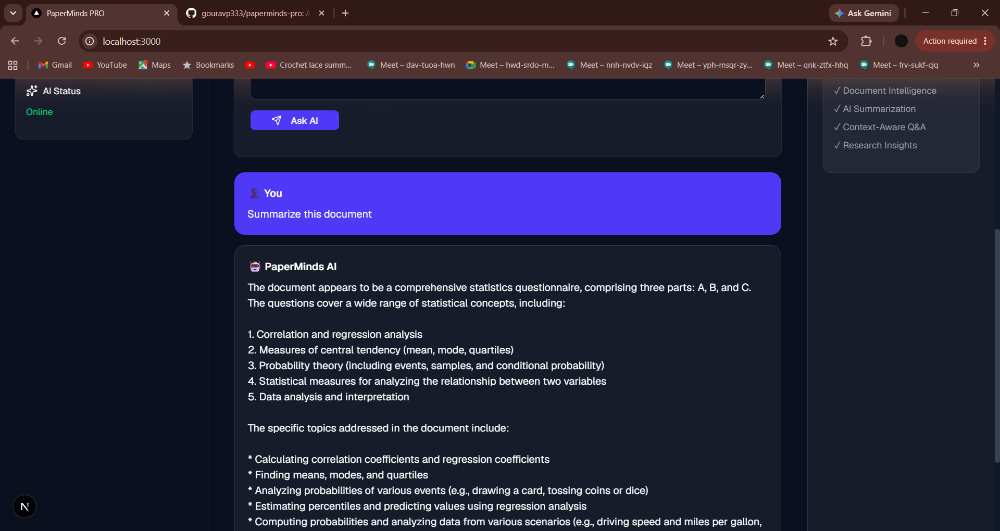

# PaperMinds PRO

AI-powered research assistant for analyzing, summarizing, and understanding academic documents.

## Features

* PDF Upload & Processing
* AI-powered Question Answering
* Research Insights Dashboard
* Document Statistics
* Modern Next.js UI
* FastAPI Backend

## Tech Stack

### Frontend

* Next.js
* TypeScript
* Tailwind CSS
* Shadcn UI

### Backend

* Python
* FastAPI
* AI Integration

## Installation

### Frontend

```bash
npm install
npm run dev
```

### Backend

```bash
pip install -r requirements.txt
uvicorn main:app --reload
```

## Screenshots

### Dashboard


### PDF Upload


### AI Response


## Author

Gourav P

